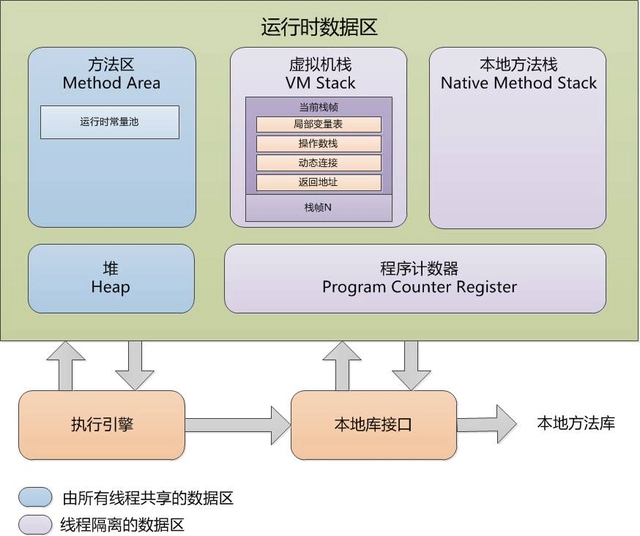

# JVM面试题整理

1. 什么是JVM?

	JVM（Java Virtual Machine）是一种能够解释并执行 Java 代码的虚拟机。它是 Java 平台的核心部分，可以在不同的操作系统和硬件平台上运行相同的 Java 程序。JVM 是一个抽象的计算机，在其上执行的 Java 代码被编译成字节码格式，然后由 JVM 解释执行。JVM 还提供了内存管理、垃圾回收、安全性控制等功能，使得 Java 程序可以自动管理内存并具有高度的可移植性和安全性。

2. JVM 有哪些组件？

	JVM 包含三个主要的组件：类加载器、运行时数据区和执行引擎。

	- 类加载器负责加载字节码文件并生成对应的 Java 类。
	- 运行时数据区包含了 JVM 中的各种内存区域，例如堆、栈、方法区等。
	- 执行引擎负责执行字节码文件，并将其转换成实际的机器指令。

3. Hotspot JVM 后台运行的系统线程主要有哪些？

	- 垃圾回收线程：负责对堆内存中的对象进行垃圾回收，释放不再使用的内存空间。
	- 编译器线程：负责即时编译字节码成本地代码，提高程序运行效率。
	- 信号分发线程：负责将操作系统发送的信号转换为Java虚拟机能够识别的异常，并交由相应的处理器处理。
	- 异常处理器线程：负责处理与Java虚拟机相关的异常，如线程死锁、资源耗尽等异常。
	- 定时器线程：负责触发周期性任务的执行，如java.util.Timer和java.util.concurrent.ScheduledThreadPoolExecutor类中所使用的定时器任务。
	- 监控线程：负责监控Java虚拟机的各种状态信息，如内存使用情况、线程运行状态等。
	- GC辅助线程：在执行全局垃圾回收时，负责协助完成一些必要的工作，如清理弱引用、清理SoftReference等。

## JVM运行时数据区域

1. Java虚拟机运行时数据区

	

2. 程序计数器（线程私有）

	一块较小的内存空间, 是当前线程所执行的字节码的行号指示器，每条线程都要有一个独立的程序计数器，这类内存也称为“线程私有”的内存。

	如果线程正在执行的是一个Java方法，这个计数器记录的是正在执行的虚拟机字节码指令的地址；

	如果正在执行的是Native方法，这个计数器值则为空。

	此内存区域是唯一一个在虚拟机中没有规定任何 OutOfMemoryError 情况的区域。

3. 虚拟机栈（线程私有）

	描述java方法执行的内存模型，每个方法在执行的同时都会创建一个栈帧（Stack Frame），用于存储局部变量表、操作数栈、动态链接、方法出口等信息。

	每一个方法从调用直至执行完成的过程，就对应着一个栈帧在虚拟机栈中入栈到出栈的过程。

	生命周期与线程相同。

4. 本地方法栈（线程私有）

	和虚拟机栈所发挥的作用非常相似，区别是： **虚拟机栈为虚拟机执行 Java 方法 （也就是字节码）服务，而本地方法栈则为虚拟机使用到的 Native 方法服务。** 在 HotSpot 虚拟机中和 Java 虚拟机栈合二为一。

5. Java堆

	Java 虚拟机所管理的内存中最大的一块，Java 堆是所有线程共享的一块内存区域，在虚拟机启动时创建。

	**此内存区域的唯一目的就是存放对象实例，几乎所有的对象实例以及数组都在这里分配内存。**

	Java 堆是垃圾收集器管理的主要区域，因此也被称作 **GC 堆（Garbage Collected Heap）**。从垃圾回收的角度，由于现在收集器基本都采用分代垃圾收集算法，所以 Java 堆还可以细分为：新生代和老年代；再细致一点有：Eden、Survivor、Old 等空间。进一步划分的目的是更好地回收内存，或者更快地分配内存。

6. 方法区

	方法区属于是 JVM 运行时数据区域的一块逻辑区域，是各个线程共享的内存区域。

	《Java 虚拟机规范》只是规定了有方法区这么个概念和它的作用，方法区到底要如何实现那就是虚拟机自己要考虑的事情了。也就是说，在不同的虚拟机实现上，方法区的实现是不同的。

	当虚拟机要使用一个类时，它需要读取并解析 Class 文件获取相关信息，再将信息存入到方法区。方法区会存储已被虚拟机加载的 **类信息、字段信息、方法信息、常量、静态变量、即时编译器编译后的代码缓存等数据**。

7. 栈帧

	用于支持虚拟机进行方法调用和方法执行的数据结构，它是虚拟机运行时数据区中的虚拟机栈的栈元素。

	栈帧包含了局部变量表、操作数栈、动态链接、方法返回地址等。

8. 局部变量表

	主要存放了编译期可知的各种数据类型（boolean、byte、char、short、int、float、long、double）、对象引用（reference 类型，它不同于对象本身，可能是一个指向对象起始地址的引用指针，也可能是指向一个代表对象的句柄或其他与此对象相关的位置）。

9. 操作数栈

	主要作为方法调用的中转站使用，用于存放方法执行过程中产生的中间计算结果。另外，计算过程中产生的临时变量也会放在操作数栈中。

10. 动态链接

	主要服务一个方法需要调用其他方法的场景。Class 文件的常量池里保存有大量的符号引用比如方法引用的符号引用。当一个方法要调用其他方法，需要将常量池中指向方法的符号引用转化为其在内存地址中的直接引用。动态链接的作用就是为了将符号引用转换为调用方法的直接引用，这个过程也被称为 **动态连接** 。

11. 运行时常量池

	方法区的一部分。

	运行时常量池（Runtime Constant Pool）是在Java虚拟机（JVM）的内存中存储常量的一种数据结构。它包含了类文件中描述的各种类型的常量，例如字符串常量、数字常量、方法和字段引用、类和接口名等。

	在Java程序运行期间，通过运行时常量池中的符号引用来定位具体的内存地址，从而实现对常量的访问。这个过程称为解析。

	需要注意的是，运行时常量池是每个Class文件独有的，它与其他的Class文件共享的只是常量池中的常量引用。同时，运行时常量池也不一定是固定不变的，例如可以使用String.intern()方法将一个字符串对象添加到常量池中，或者通过反射和动态代理技术来修改常量池中的内容。

12. 字符串常量池

	**字符串常量池** 是 JVM 为了提升性能和减少内存消耗针对字符串（String 类）专门开辟的一块区域，主要目的是为了避免字符串的重复创建。

	字符串常量池（String Constant Pool）是运行时常量池中的一种特殊形式，用于存储Java程序中使用字面值方式创建的字符串对象。在Java中，当我们使用双引号定义一个字符串变量时，会首先检查字符串常量池中是否已经存在该字符串，如果已经存在，则直接返回该字符串的引用，否则创建一个新的字符串对象，并在字符串常量池中保存这个字符串。

13. 直接内存

	直接内存是一种特殊的内存缓冲区，并不在 Java 堆或方法区中分配的，而是通过 JNI 的方式在本地内存上分配的。

	直接内存并不是虚拟机运行时数据区的一部分，也不是虚拟机规范中定义的内存区域，但是这部分内存也被频繁地使用。而且也可能导致 `OutOfMemoryError` 错误出现。

## JVM垃圾收集

1. 判断一个对象是否可以被回收？

	- 引用计数法：为对象添加一个引用计数器，当对象增加一个引用时计数器加 1，引用失效时计数器减 1。引用计数为 0 的对象可被回收。在两个对象出现循环引用的情况下，此时引用计数器永远不为 0，导致无法对它们进行回收。正是因为循环引用的存在，因此 Java 虚拟机不使用引用计数算法。
	- 可达性分析算法：以 GC Roots 为起始点进行搜索，可达的对象都是存活的，不可达的对象可被回收。

2. 哪些对象可以作为GC Roots？

	- 虚拟机栈中（栈帧的局部变量表中）引用的对象
	- 本地方法栈(Native 方法)中引用的对象
	- 方法区中类静态属性引用的对象
	- 方法区中的常量引用的对象
	- 所有被同步锁持有的对象

3. 如何判断一个类是无用的类？

  - 该类所有的实例都已经被回收，也就是 Java 堆中不存在该类的任何实例。
  - 加载该类的 `ClassLoader` 已经被回收。
  - 该类对应的 `java.lang.Class` 对象没有在任何地方被引用，无法在任何地方通过反射访问该类的方法。

4. 方法区的回收

	因为方法区主要存放永久代对象，而永久代对象的回收率比新生代低很多，所以在方法区上进行回收性价比不高。

	主要是对常量池的回收和对类的卸载。

	为了避免内存溢出，在大量使用反射和动态代理的场景都需要虚拟机具备类卸载功能。

	虚拟机可以对满足上述 3 个条件的无用类进行回收，这里说的仅仅是“可以”，而并不是和对象一样不使用了就会必然被回收。

5. 四种引用类型

	- 强引用：被强引用关联的对象不会被回收。

		使用 new 一个新对象的方式来创建强引用。

		```java
		Object obj = new Object();
		```

	- 软引用：被软引用关联的对象只有在内存不够的情况下才会被回收。

		使用 SoftReference 类来创建软引用。

		```java
		Object obj = new Object();
		SoftReference<Object> sf = new SoftReference<Object>(obj);
		obj = null;  // 使对象只被软引用关联
		```

	- 弱引用：被弱引用关联的对象一定会被回收，也就是说它只能存活到下一次垃圾回收发生之前。

		使用 WeakReference 类来创建弱引用。

		```java
		Object obj = new Object();
		WeakReference<Object> wf = new WeakReference<Object>(obj);
		obj = null;
		```

	- 虚引用：又称为幽灵引用或者幻影引用，一个对象是否有虚引用的存在，不会对其生存时间造成影响，也无法通过虚引用得到一个对象。

		为一个对象设置虚引用的唯一目的是能在这个对象被回收时收到一个系统通知。

		使用 PhantomReference 来创建虚引用。

		```java
		Object obj = new Object();
		PhantomReference<Object> pf = new PhantomReference<Object>(obj, null);
		obj = null;
		```

### 垃圾收集算法

1. 标记-清除（Mark-and-Sweet）算法

	算法分为“标记（Mark）”和“清除（Sweep）”阶段：首先标记出所有不需要回收的对象，在标记完成后统一回收掉所有没有被标记的对象。

	它是最基础的收集算法，后续的算法都是对其不足进行改进得到。

	缺点：

	- **效率问题**：标记和清除两个过程效率都不高。
	- **空间问题**：标记清除后会产生大量不连续的内存碎片。

2. 标记整理算法

	让所有存活的对象都向一端移动，然后直接清理掉端边界以外的内存。

	优点：

	- 不会产生内存碎片

	缺点：

	- 需要移动大量对象，处理效率比较低。

3. 复制算法

	将内存划分为大小相等的两块，每次只使用其中一块，当这一块内存用完了就将还存活的对象复制到另一块上面，然后再把使用过的内存空间进行一次清理。

	缺点：

	- **可用内存变小**：可用内存缩小为原来的一半。
	- **不适合老年代**：如果存活对象数量比较大，复制性能会变得很差。

	现在的商业虚拟机都采用这种收集算法回收新生代，但是并不是划分为大小相等的两块，而是一块较大的 Eden 空间和两块较小的 Survivor 空间，每次使用 Eden 和其中一块 Survivor。在回收时，将 Eden 和 Survivor 中还存活着的对象全部复制到另一块 Survivor 上，最后清理 Eden 和使用过的那一块 Survivor。

	HotSpot 虚拟机的 Eden 和 Survivor 大小比例默认为 8:1，保证了内存的利用率达到 90%。如果每次回收有多于 10% 的对象存活，那么一块 Survivor 就不够用了，此时需要依赖于老年代进行空间分配担保，也就是借用老年代的空间存储放不下的对象。

4. 分代收集

	现在的商业虚拟机采用分代收集算法，它根据对象存活周期将内存划分为几块，不同块采用适当的收集算法。

	一般将堆分为新生代和老年代。

	- 新生代使用：复制算法
	- 老年代使用：标记 - 清除 或者 标记 - 整理 算法

### 垃圾收集器

1. Serial收集器

	Serial 翻译为串行，也就是说它以串行的方式执行。

	它是单线程的收集器，只会使用一个线程进行垃圾收集工作。

	它的优点是简单高效，对于单个 CPU 环境来说，由于没有线程交互的开销，因此拥有最高的单线程收集效率。

	它是 Client 模式下的默认新生代收集器，因为在用户的桌面应用场景下，分配给虚拟机管理的内存一般来说不会很大。Serial 收集器收集几十兆甚至一两百兆的新生代停顿时间可以控制在一百多毫秒以内，只要不是太频繁，这点停顿是可以接受的。

	**新生代采用标记-复制算法，老年代采用标记-整理算法。**

2. ParNew收集器

	它是 Serial 收集器的多线程版本。

	是 Server 模式下的虚拟机首选新生代收集器，除了性能原因外，主要是因为除了 Serial 收集器，只有它能与 CMS 收集器配合工作。

	在JDK1.5 时期，HotSpot 推出了 CMS 收集器（Concurrent Mark Sweep），它是 HotSpot 虚拟机中第一款真正意义上的**并发收集器**。不幸的是，CMS 作为老年代的收集器，却无法与 JDK1.4.0 中已经存在的新生代收集器 Parallel Scavenge 配合工作，**所以在 JDK1.5中使用 CMS 来收集老年代的时候，新生代只能选择 ParNew 或者 Serial 收集器中的一个**。

	默认开启的线程数量与 CPU 数量相同，可以使用 -XX:ParallelGCThreads 参数来设置线程数。

	> *Parallel Scavenge 收集器以及后面提到的 G1 收集器都没有使用传统的 GC 收集器代码框架，而另外独立实现，其余集中收集器则共用了部分的框架代码。*

3. Parallel Scavenge

	Parallel Scavenge 收集器是一个新生代收集器，它也是使用复制算法的收集器。

	Parallel Scavenge 收集器关注点是吞吐量（高效率的利用 CPU）。CMS 等垃圾收集器的关注点更多的是用户线程的停顿时间（提高用户体验）。所谓吞吐量就是 CPU 中用于运行用户代码的时间与 CPU 总消耗时间的比值。

	停顿时间越短就越适合需要与用户交互的程序，良好的响应速度能提升用户体验。而高吞吐量则可以高效率地利用 CPU 时间，尽快完成程序的运算任务，主要适合在后台运算而不需要太多交互的任务。

	缩短停顿时间是以牺牲吞吐量和新生代空间来换取的：新生代空间变小，垃圾回收变得频繁，导致吞吐量下降。

	可以通过一个开关参数打卡 GC 自适应的调节策略（GC Ergonomics），就不需要手工指定新生代的大小（-Xmn）、Eden 和 Survivor 区的比例、晋升老年代对象年龄等细节参数了。虚拟机会根据当前系统运行情况收集性能监控信息，动态调整这些参数，以提供最合适的停顿时间或最大的吞吐量，这种调节方式称为**GC自适应的调节策略（GC Ergonomiscs）** 。

	Parallel Scavenge 收集器气提供了两个参数用于**精确控制吞吐量**

	- **最大垃圾收集停顿时间：** -XX:MaxGCPauseMills
	- **吞吐量大小：**-XX:GCTimeRatio

	**MaxGCPauseMills** 参数允许的值是一个大于0的毫秒数，收集器将尽可能地保证内存回收所花费的时间不超过设定值。但 GC 的停顿时间缩短是以牺牲吞吐量和新生代空间来换取的。停顿时间下降，但吞吐量也降下来了。

	**GCTimeRatio** 参数的值是一个大于0且小于100的整数，也就是垃圾收集时间占总时间的比例，相当于吞吐量的倒数。区间 1/(1+99) ~ 1/(1+1)，即 1% ~ 50%。

	由于与吞吐量关系密切，Parallel Scavenge 收集器也经常称为 “吞吐量优先“ 收集器。

	**-XX:+UserAdaptiveSizePolicy**： GC 自适应调节策略（GC Ergonomics），打开参数后，就不需要手工指定新生代的大小（-Xmn）、Eden 与 Survivor 区的比例（-XX:SurvivorRatio）、晋升老年代对象的年龄（-XX:PretenureSizeThreshold）等细节参数了。停顿时间越短就越适合需要与用户交互的程序，良好的响应速度能提升用户体验。而高吞吐量则可以高效率地利用 CPU 时间，尽快完成程序的运算任务，主要适合在后台运算而不需要太多交互的任务。

	缩短停顿时间是以牺牲吞吐量和新生代空间来换取的：新生代空间变小，垃圾回收变得频繁，导致吞吐量下降。

	可以通过一个开关参数打卡 GC 自适应的调节策略（GC Ergonomics），就不需要手工指定新生代的大小（-Xmn）、Eden 和 Survivor 区的比例、晋升老年代对象年龄等细节参数了。虚拟机会根据当前系统运行情况收集性能监控信息，动态调整这些参数，以提供最合适的停顿时间或最大的吞吐量，这种调节方式称为**GC自适应的调节策略（GC Ergonomiscs）** 。

	Parallel Scavenge 收集器气提供了两个参数用于**精确控制吞吐量**

	- **最大垃圾收集停顿时间：** -XX:MaxGCPauseMills
	- **吞吐量大小：**-XX:GCTimeRatio

	**MaxGCPauseMills** 参数允许的值是一个大于0的毫秒数，收集器将尽可能地保证内存回收所花费的时间不超过设定值。但 GC 的停顿时间缩短是以牺牲吞吐量和新生代空间来换取的。停顿时间下降，但吞吐量也降下来了。

	**GCTimeRatio** 参数的值是一个大于0且小于100的整数，也就是垃圾收集时间占总时间的比例，相当于吞吐量的倒数。区间 1/(1+99) ~ 1/(1+1)，即 1% ~ 50%。

	由于与吞吐量关系密切，Parallel Scavenge 收集器也经常称为 “吞吐量优先“ 收集器。

	**-XX:+UserAdaptiveSizePolicy**： GC 自适应调节策略（GC Ergonomics），打开参数后，就不需要手工指定新生代的大小（-Xmn）、Eden 与 Survivor 区的比例（-XX:SurvivorRatio）、晋升老年代对象的年龄（-XX:PretenureSizeThreshold）等细节参数了。

4. Serial Old

	Serial Old 是 Serial 收集器的老年代版本，它同样是一个单线程收集器，使用 ”标记-整理“ 算法。

	这个收集器的主要意义也是在于给 Client 模式下的虚拟机使用。如果在 Server 模式下，那么它主要还有两大用途：

	- 在 JDK 1.5 以及之前版本（Parallel Old 诞生以前）中与 Parallel Scavenge 收集器搭配使用。
	- 作为 CMS 收集器的后备预案，在并发收集发生 Concurrent Mode Failure 时使用。

5. Parallel Old 

	Parallel Old是 Parallel Scavenge 收集器的老年代版本，使用多线程和 ”标记-整理“ 算法。

	在注重吞吐量以及 CPU 资源敏感的场合，都可以优先考虑 Parallel Scavenge 加 Parallel Old 收集器。

6. CMS

	CMS（Concurrent Mark Sweep），Mark Sweep 指的是 **标记 - 清除** 算法。CMS 是一款优秀的收集器，主要优点：并发收集、低停顿，Sun公司也称之为**并发低停顿收集器**（Concurrent Low Pause Collection）。

	特点：并发收集、低停顿。

	分为以下四个流程：

	- 初始标记：仅仅只是标记一下 GC Roots 能直接关联到的对象，速度很快，需要停顿。
	- **并发标记**：进行 GC Roots Tracing 的过程，它在整个回收过程中耗时最长，不需要停顿。
	- 重新标记：为了修正并发标记期间因用户程序继续运作而导致标记产生变动的那一部分对象的标记记录，需要停顿。
	- **并发清除**：不需要停顿。

	在整个过程中耗时最长的**并发标记**和**并发清除**过程中，收集器线程都可以与用户线程一起工作，不需要进行停顿。

	具有以下缺点：

	- 吞吐量低：低停顿时间是以牺牲吞吐量为代价的，导致 CPU 利用率不够高。
	- 无法处理浮动垃圾，可能出现 Concurrent Mode Failure。浮动垃圾是指并发清除阶段由于用户线程继续运行而产生的垃圾，这部分垃圾只能到下一次 GC 时才能进行回收。由于浮动垃圾的存在，因此需要预留出一部分内存，意味着 CMS 收集不能像其它收集器那样等待老年代快满的时候再回收。如果预留的内存不够存放浮动垃圾，就会出现 Concurrent Mode Failure，这时虚拟机将临时启用 Serial Old 来替代 CMS。
	- 标记 - 清除算法导致的空间碎片，往往出现老年代空间剩余，但无法找到足够大连续空间来分配当前对象，不得不提前触发一次 Full GC。
		- CMS 提供了一个开关参数 **-XX:+UseCMSCompactAtFullCollection**（默认开启），用于在 CMS 收集器顶不住要进行 Full GC 时开启内存碎片的合并整理过程，内存整理的过程是无法并发的。
		- 参数 **-XX:CMSFullGCsBeforeCompaction** 用于设置执行多少次不压缩的 Full GC后，跟着来以此带压缩的，（默认值为0）

7. G1

	G1（Garbage-First），它是一款面向服务端应用的垃圾收集器，在多 CPU 和大内存的场景下有很好的性能。HotSpot 开发团队赋予它的使命是未来可以替换掉 CMS 收集器。

	堆被分为新生代和老年代，其它收集器进行收集的范围都是整个新生代或者老年代，而 G1 可以直接对新生代和老年代一起回收。

	G1 把堆划分成多个大小相等的独立区域（Region），新生代和老年代不再物理隔离。

	通过引入 Region 的概念，从而将原来的一整块内存空间划分成多个的小空间，使得每个小空间可以单独进行垃圾回收。这种划分方法带来了很大的灵活性，使得可预测的停顿时间模型成为可能。通过记录每个 Region 垃圾回收时间以及回收所获得的空间（这两个值是通过过去回收的经验获得），并维护一个优先列表，每次根据允许的收集时间，优先回收价值最大的 Region。

	每个 Region 都有一个 Remembered Set，用来记录该 Region 对象的引用对象所在的 Region。通过使用 Remembered Set，在做可达性分析的时候就可以避免全堆扫描。

	如果不计算维护 Remembered Set 的操作，G1 收集器的运作大致可划分为以下几个步骤：

	- 初始标记
	- 并发标记
	- 最终标记：为了修正在并发标记期间因用户程序继续运作而导致标记产生变动的那一部分标记记录，虚拟机将这段时间对象变化记录在线程的 Remembered Set Logs 里面，最终标记阶段需要把 Remembered Set Logs 的数据合并到 Remembered Set 中。这阶段需要停顿线程，但是可并行执行。
	- 筛选回收：首先对各个 Region 中的回收价值和成本进行排序，根据用户所期望的 GC 停顿时间来制定回收计划。此阶段其实也可以做到与用户程序一起并发执行，但是因为只回收一部分 Region，时间是用户可控制的，而且停顿用户线程将大幅度提高收集效率。

	具备如下特点：

	- 空间整合：整体来看是基于“标记 - 整理”算法实现的收集器，从局部（两个 Region 之间）上来看是基于“复制”算法实现的，这意味着运行期间不会产生内存空间碎片。
	- 可预测的停顿：能让使用者明确指定在一个长度为 M 毫秒的时间片段内，消耗在 GC 上的时间不得超过 N 毫秒。

8. 垃圾收集器比较

	| 收集器                | 单线程/并行 | 串行/并发 | 新生代/老年代   | 收集算法             | 目标         | 适用场景                                      |
	| --------------------- | ----------- | --------- | --------------- | -------------------- | ------------ | --------------------------------------------- |
	| **Serial**            | 单线程      | 串行      | 新生代          | 复制算法             | 响应速度优先 | 单 CPU 环境下的 Client 模式                   |
	| **ParNew**            | 并行        | 串行      | 新生代          | 复制算法             | 响应速度优先 | 多 CPU 环境时在 Server 模式下与 CMS 配合      |
	| **Parallel Scavenge** | 并行        | 串行      | 新生代          | 复制算法             | 吞吐量优先   | 在后台运算而不需要太多交互的任务              |
	| **Serial Old**        | 单线程      | 串行      | 老年代          | 标记-整理            | 响应速度优先 | 单 CPU 环境下的 Client 模式、CMS 的后备预案   |
	| **Parallel Old**      | 并行        | 串行      | 老年代          | 标记-整理            | 吞吐量优先   | 在后台运算而不需要太多交互的任务              |
	| **CMS**               | 并行        | 并发      | 老年代          | 标记-清除            | 响应速度优先 | 集中在互联网站或 B/S 系统服务端上的 Java 应用 |
	| **G1**                | 并行        | 并发      | 新生代 + 老年代 | 标记-整理 + 复制算法 | 响应速度优先 | 面向服务端应用，将来替换 CMS                  |

## 内存分配与回收策略

1. 内存分配策略

	- **对象优先在Eden区分配**

		大多数情况下，对象在新生代中 Eden 区分配。当 Eden 区没有足够空间进行分配时，虚拟机将发起一次 Minor GC。GC 期间虚拟机又发现对象无法存入 Survivor 空间，所以只好通过 **分配担保机制** 把新生代的对象提前转移到老年代中去，老年代上的空间足够存放对象，所以不会出现 Full GC。执行 Minor GC 后，后面分配的对象如果能够存在 Eden 区的话，还是会在 Eden 区分配内存。

	- **大对象直接进入老年代**

		大对象就是需要大量连续内存空间的对象（比如：字符串、数组）。

		大对象直接进入老年代主要是为了避免为大对象分配内存时由于分配担保机制带来的复制而降低效率。

	- **长期存活的对象进入老年代**

		大部分情况，对象都会首先在 Eden 区域分配。如果对象在 Eden 出生并经过第一次 Minor GC 后仍然能够存活，并且能被 Survivor 容纳的话，将被移动到 Survivor 空间（s0 或者 s1）中，并将对象年龄设为 1(Eden 区->Survivor 区后对象的初始年龄变为 1)。

		对象在 Survivor 中每熬过一次 MinorGC,年龄就增加 1 岁，当它的年龄增加到一定程度（默认为 15 岁），就会被晋升到老年代中。对象晋升到老年代的年龄阈值，可以通过参数 `-XX:MaxTenuringThreshold` 来设置。**默认晋升年龄并不都是 15，这个是要区分垃圾收集器的，CMS 就是 6.**

	- **动态对象年龄判定**

		虚拟机并不是永远地要求对象的年龄必须达到 MaxTenuringThreshold 才能晋升老年代，如果在 Survivor 中相同年龄所有对象大小的总和大于 Survivor 空间的一半，则年龄大于或等于该年龄的对象可以直接进入老年代，无需等到 MaxTenuringThreshold 中要求的年龄。

	- **空间分配担保**

2. 空间分配担保

	JDK 6 Update 24 之前，在发生 Minor GC 之前，虚拟机必须先检查老年代最大可用的连续空间是否大于新生代所有对象总空间，如果这个条件成立，那这一次 Minor GC 可以确保是安全的。如果不成立，则虚拟机会先查看 `-XX:HandlePromotionFailure` 参数的设置值是否允许担保失败(Handle Promotion Failure);如果允许，那会继续检查老年代最大可用的连续空间是否大于历次晋升到老年代对象的平均大小，如果大于，将尝试进行一次 Minor GC，尽管这次 Minor GC 是有风险的;如果小于，或者 `-XX: HandlePromotionFailure` 设置不允许冒险，那这时就要改为进行一次 Full GC。

	JDK 6 Update 24 之后的规则变为只要老年代的连续空间大于新生代对象总大小或者历次晋升的平均大小，就会进行 Minor GC，否则将进行 Full GC。

3. Minor GC和Major GC

	- Minor GC：发生在新生代上，因为新生代对象存活时间很短，因此 Minor GC 会频繁执行，执行的速度一般也会比较快。
		- 新生代中的垃圾收集动作，采用的是复制算法
		- 对于较大的对象，在 Minor GC 的时候可以直接进入老年代
	- Major GC（Full GC）：发生在老年代上，老年代对象其存活时间长，因此 Full GC 很少执行，执行速度会比 Minor GC 慢很多。
		- Full GC 是发生在老年代的垃圾收集动作，采用的是 标记-清除/整理 算法。
		- 由于老年代的对象几乎都是在 Survivor 区熬过来的，不会那么容易死掉。因此 Full GC 发生的次数不会有 Minor GC 那么频繁，并且 Time(Full GC)>Time(Minor GC)

4. Full GC的触发条件

	对于 Minor GC，其触发条件非常简单，当 Eden 空间满时，就将触发一次 Minor GC。而 Full GC 则相对复杂，有以下条件：

	- 调用 System.gc()

		只是建议虚拟机执行 Full GC，但是虚拟机不一定真正去执行。不建议使用这种方式，而是让虚拟机管理内存。

	- 老年代空间不足

		老年代空间不足的常见场景为前文所讲的大对象直接进入老年代、长期存活的对象进入老年代等。

		为了避免以上原因引起的 Full GC，应当尽量不要创建过大的对象以及数组。除此之外，可以通过 -Xmn 虚拟机参数调大新生代的大小，让对象尽量在新生代被回收掉，不进入老年代。还可以通过 -XX:MaxTenuringThreshold 调大对象进入老年代的年龄，让对象在新生代多存活一段时间。

	- 空间分配担保失

		使用复制算法的 Minor GC 需要老年代的内存空间作担保，如果担保失败会执行一次 Full GC。具体内容请参考上面的第五小节。

	- JDK 1.7 及以前的永久代空间不足

		在 JDK 1.7 及以前，HotSpot 虚拟机中的方法区是用永久代实现的，永久代中存放的为一些 Class 的信息、常量、静态变量等数据。

		当系统中要加载的类、反射的类和调用的方法较多时，永久代可能会被占满，在未配置为采用 CMS GC 的情况下也会执行 Full GC。如果经过 Full GC 仍然回收不了，那么虚拟机会抛出 java.lang.OutOfMemoryError。

		为避免以上原因引起的 Full GC，可采用的方法为增大永久代空间或转为使用 CMS GC。

	- Concurrent Mode Failure
	- 执行 CMS GC 的过程中同时有对象要放入老年代，而此时老年代空间不足（可能是 GC 过程中浮动垃圾过多导致暂时性的空间不足），便会报 Concurrent Mode Failure 错误，并触发 Full GC。

## 类加载机制

1. 类的生命周期

	类从被加载到虚拟机内存中开始到卸载出内存为止，它的整个生命周期可以简单概括为 7 个阶段：：加载（Loading）、验证（Verification）、准备（Preparation）、解析（Resolution）、初始化（Initialization）、使用（Using）和卸载（Unloading）。

2. 类初始化时机

	对于初始化阶段，虚拟机严格规范了有且只有 5 种情况下，必须对类进行初始化(只有主动去使用类才会初始化类)：

	- 当遇到 `new`、 `getstatic`、`putstatic` 或 `invokestatic` 这 4 条字节码指令时，比如 `new` 一个类，读取一个静态字段(未被 final 修饰)、或调用一个类的静态方法时。 

		- 当 jvm 执行 `new` 指令时会初始化类。即当程序创建一个类的实例对象。

		- 当 jvm 执行 `getstatic` 指令时会初始化类。即程序访问类的静态变量(不是静态常量，常量会被加载到运行时常量池)。

		- 当 jvm 执行 `putstatic` 指令时会初始化类。即程序给类的静态变量赋值。

		- 当 jvm 执行 `invokestatic` 指令时会初始化类。即程序调用类的静态方法。

	- 使用 `java.lang.reflect` 包的方法对类进行反射调用时如 `Class.forname("...")`, `newInstance()` 等等。如果类没初始化，需要触发其初始化。

	- 初始化一个类，如果其父类还未初始化，则先触发该父类的初始化。

	- 当虚拟机启动时，用户需要定义一个要执行的主类 (包含 `main` 方法的那个类)，虚拟机会先初始化这个类。

	- 当使用 JDK 1.7 的动态语言支持时，如果一个 java.lang.invoke.MethodHandle 实例最后的解析结果为 REF_getStatic, REF_putStatic, REF_invokeStatic 的方法句柄，并且这个方法句柄所对应的类没有进行过初始化，则需要先触发其初始化；

3. 加载

	类加载过程的第一步，主要完成下面 3 件事情：

	1. 通过全类名获取定义此类的二进制字节流。
	2. 将字节流所代表的静态存储结构转换为方法区的运行时数据结构。
	3. 在内存中生成一个代表该类的 `Class` 对象，作为方法区这些数据的访问入口。

	每个 Java 类都有一个引用指向加载它的 `ClassLoader`。不过，数组类不是通过 `ClassLoader` 创建的，而是 JVM 在需要的时候自动创建的，数组类通过`getClassLoader()`方法获取 `ClassLoader` 的时候和该数组的元素类型的 `ClassLoader` 是一致的。

	一个非数组类的加载阶段（加载阶段获取类的二进制字节流的动作）是可控性最强的阶段，这一步我们可以去完成还可以自定义类加载器去控制字节流的获取方式（重写一个类加载器的 `loadClass()` 方法）。

	加载阶段与连接阶段的部分动作(如一部分字节码文件格式验证动作)是交叉进行的，加载阶段尚未结束，连接阶段可能就已经开始了。

4. 验证

	目的：确保 Class 文件的字节流中包含的信息符合当前虚拟机的要求，并且不会危害虚拟机自身的安全。

	- 文件格式验证：验证字节流是否符合 Class 文件格式的规范，并且能被当前版本的虚拟机处理。
		- 是否以 0xCAFEBABE 开头，前四个字节为魔数
		- 版本号是否合理，如：JDK1.8（52.0）、JDK1.7（51.0）
	- 元数据验证：对字节码描述的信息进行语义分析，以保证其描述的信息符合 Java 语言规范的要求。
		- 是否有父类
		- 继承了 final 类？
		- 非抽象类实现了所有的抽象方法
	- 字节码验证（很复杂）：通过数据流和控制流分析，确保程序语义是合法、符合逻辑的。
		- 运行检查
		- 栈数据类型和操作码数据参数吻合
		- 跳转指令指定到合理的位置
	- 符号引用验证：发生在虚拟机将符号引用转换为直接引用的时候，对类自身以外（常量池中的各种符号引用）的信息进行匹配性校验。
		- 常量池中描述类是否存在
		- 访问的方法或字段是否存在且有足够的权限

5. 准备

	**准备阶段是正式为类变量分配内存并设置类变量初始值的阶段**，这些内存都将在方法区中分配。对于该阶段有以下几点需要注意：

	1. 这时候进行内存分配的仅包括类变量（ Class Variables ，即静态变量，被 `static` 关键字修饰的变量，只与类相关，因此被称为类变量），而不包括实例变量。实例变量会在对象实例化时随着对象一块分配在 Java 堆中。
	2. 从概念上讲，类变量所使用的内存都应当在 **方法区** 中进行分配。不过有一点需要注意的是：JDK 7 之前，HotSpot 使用永久代来实现方法区的时候，实现是完全符合这种逻辑概念的。 而在 JDK 7 及之后，HotSpot 已经把原本放在永久代的字符串常量池、静态变量等移动到堆中，这个时候类变量则会随着 Class 对象一起存放在 Java 堆中。
	3. 这里所设置的初始值"通常情况"下是数据类型默认的零值（如 0、0L、null、false 等），比如我们定义了`public static int value=111` ，那么 value 变量在准备阶段的初始值就是 0 而不是 111（初始化阶段才会赋值）。特殊情况：比如给 value 变量加上了 final 关键字`public static final int value=111` ，那么准备阶段 value 的值就被赋值为 111。

6. 解析

	解析阶段是虚拟机将常量池的**符号引用替换为直接引用**的过程

	- 类或接口的解析
	- 字段解析
	- 类方法解析
	- 接口方法解析

7. **什么是符号引用和直接引用？**

	- **符号引用**：符号引用是一组符号来描述所引用的目标对象，符号可以是任何形式的字面量，只要使用时能无歧义地定位到目标即可。符号引用与虚拟机实现的内存布局无关，引用的目标对象并不一定已经加载到内存中。
	- **直接引用**：直接引用可以是直接指向目标对象的指针、相对偏移量或是一个能间接定位到目标的句柄。直接引用是与虚拟机内存布局实现相关的，同一个符号引用在不同虚拟机实例上翻译出来的直接引用一般不会相同，如果有了直接引用，那引用的目标必定已经在内存中存在。

8. Java 对象的创建过程可以具体分为以下几个步骤：

	- 检查类是否被加载

		在创建一个对象之前，JVM 需要先检查该对象所属的类是否已经被加载到内存中。如果没有被加载，JVM 会根据需要从磁盘上读取类文件，并进行加载和链接。


	- 分配内存空间

		当类被加载后，JVM 会为该类的对象分配一块连续的内存空间。在分配内存空间时，JVM 会根据对象的大小以及 JVM 的内存分配策略来确定对象在内存中的实际位置。


	- 初始化对象头

		在分配内存空间后，JVM 会对对象头进行一些初始化操作。对象头是每个 Java 对象都有的固定字节长度的数据结构，它包含了很多元数据信息，比如对象的类型、哈希码、锁状态等信息。


	- 执行构造方法

		在对象头初始化完成后，接下来就是执行构造方法的过程。构造方法是类中特殊的方法，用于对对象进行初始化操作。在执行构造方法时，会对对象的属性进行赋值，并进行其他必要的初始化工作。


	- 返回对象引用

	- 当对象初始化完成后，JVM 会返回对象在堆内存中的地址值，这个地址值就是对象的引用，可以用来访问对象的属性和方法。

	总的来说，Java 对象的创建过程包括检查类是否被加载、分配内存空间、初始化对象头、执行构造方法和返回对象引用这几个步骤。这个过程是比较复杂的，需要考虑多种因素，比如类的大小、内存分配策略、构造方法的实现等等。但是，Java 对象的创建过程是 Java 程序的基础，也是保证程序正确性和性能的重要环节。

	


## 参考资料

https://github.com/wangyufengx/fullstack-tutorial/blob/master/notes/JavaArchitecture/

https://github.com/CyC2018/CS-Notes/blob/master/notes/

https://javaguide.cn/java/jvm/memory-area.html

深入理解Java虚拟机

·	
