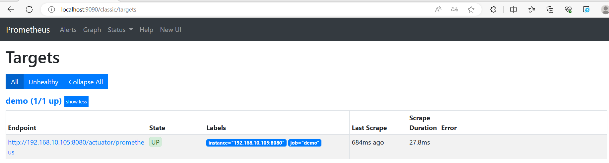

# Prometheus+Grafana+SpringBoot实现监控

本文通过Prometheus以及Grafana展示SpringBoot项目的运行情况。

## 集成Actuator

SpringBoot通过Actuator来监控和管理应用程序.只需要引入相关依赖，无须写额外的接口即可获取一些基本服务指标。

### 引入依赖

基于maven项目

```xml
<dependency>
    <groupId>org.springframework.boot</groupId>
    <artifactId>spring-boot-starter-actuator</artifactId>
</dependency>
```
基于gradle项目
```gradle
dependencies {
    implementation 'org.springframework.boot:spring-boot-starter-actuator'
}
```

### Actuator的Endpoints（端点）

| ID                 | Description                                                  |
| :----------------- | :----------------------------------------------------------- |
| `auditevents`      | 公开当前应用程序的审计事件信息。需要一个`AuditEventRepository` bean。 |
| `beans`            | 显示应用程序中所有Spring bean的完整列表。                    |
| `caches`           | 公开可用的缓存。                                             |
| `conditions`       | 显示在配置和自动配置类上评估的条件，以及它们匹配或不匹配的原因。 |
| `configprops`      | 显示所有`@ConfigurationProperties`的排序列表。               |
| `env`              | 从Spring的`ConfigurableEnvironment`中暴露属性。              |
| `flyway`           | 显示已应用的所有Flyway数据库迁移。需要一个或多个`Flyway` bean。 |
| `health`           | 显示应用程序运行状况信息。                                   |
| `httpexchanges`    | 显示HTTP交换信息(默认情况下，最近100个HTTP请求-响应交换)。需要一个`HttpExchangeRepository` bean。 |
| `info`             | 显示任意的应用信息。                                         |
| `integrationgraph` | 展示了Spring集成图。需要依赖于`spring-integration-core`。    |
| `loggers`          | 在应用程序中显示和修改记录器的配置。                         |
| `liquibase`        | 显示已应用的任何Liquibase数据库迁移。需要一个或多个`Liquibase` bean。 |
| `metrics`          | 显示当前应用程序的“度量”信息。                               |
| `mappings`         | 显示所有`@RequestMapping`路径的排序列表。                    |
| `quartz`           | 显示有关Quartz调度器作业的信息。                             |
| `scheduledtasks`   | 显示应用程序中的计划任务。                                   |
| `sessions`         | 允许从Spring会话支持的会话存储中检索和删除用户会话。需要使用Spring Session的基于servlet的web应用程序。 |
| `shutdown`         | 让应用程序优雅地关闭。只有在使用jar包装时才有效。默认关闭。  |
| `startup`          | 显示由`ApplicationStartup`收集的[启动步骤数据](https://docs.spring.io/spring-boot/docs/current/reference/html/features.html#features.spring-application.startup-tracking)。需要将`SpringApplication`配置为`BufferingApplicationStartup`。 |
| `threaddump`       | 执行线程转储。                                               |

如果你的应用程序是web应用程序(Spring MVC、Spring WebFlux或Jersey)，你可以使用以下额外的端点:

| ID           | Description                                                  |
| :----------- | :----------------------------------------------------------- |
| `heapdump`   | 返回堆转储文件。在HotSpot JVM中，会返回一个`HPROF`格式的文件。在OpenJ9 JVM中，会返回一个`PHD`格式的文件。 |
| `logfile`    | 返回日志文件的内容(如果`logging.file.name`或`logging.file.name`返回日志文件的内容)。属性已经设置)。支持使用HTTP `Range`头来检索日志文件的部分内容。 |
| `prometheus` | 以Prometheus服务器可以抓取的格式公开监控指标。需要依赖`micrometer-registry-prometheus`。 |

可以看到我们的目的是通过Prometheus来抓取监控指标，因此还需要引入依赖`micrometer-registry-prometheus`。

基于maven

```xml
<dependency>
    <groupId>io.micrometer</groupId>
    <artifactId>micrometer-registry-prometheus</artifactId>
</dependency>
```

基于gradle

```gradle
dependencies {
    implementation 'io.micrometer:micrometer-registry-prometheus'
}
```

### 配置

> By default, the endpoint is not available and must be exposed. See [exposing endpoints](https://docs.spring.io/spring-boot/docs/current/reference/html/actuator.html#actuator.endpoints.exposing) for more details.
>
> 默认情况下，端点不可用，必须公开。

需要添加如下配置

```properties
management.endpoints.web.exposure.include=prometheus,health,info
```

指定服务名

```
spring.application.name=demo
```

### 启动并访问

通过http://127.0.0.1:8080/actuator/可以看到有prometheus接口

```json
{
    "_links": {
        "self": {
            "href": "http://127.0.0.1:8080/actuator",
            "templated": false
        },
        "health": {
            "href": "http://127.0.0.1:8080/actuator/health",
            "templated": false
        },
        "health-path": {
            "href": "http://127.0.0.1:8080/actuator/health/{*path}",
            "templated": true
        },
        "info": {
            "href": "http://127.0.0.1:8080/actuator/info",
            "templated": false
        },
        "prometheus": {
            "href": "http://127.0.0.1:8080/actuator/prometheus",
            "templated": false
        }
    }
}
```

http://127.0.0.1:8080/actuator/prometheus

```
# HELP process_cpu_usage The "recent cpu usage" for the Java Virtual Machine process
# TYPE process_cpu_usage gauge
process_cpu_usage 0.004102086480016525
# HELP process_uptime_seconds The uptime of the Java virtual machine
# TYPE process_uptime_seconds gauge
process_uptime_seconds 756.76
# HELP executor_completed_tasks_total The approximate total number of tasks that have completed execution
# TYPE executor_completed_tasks_total counter
executor_completed_tasks_total{name="applicationTaskExecutor",} 0.0
# HELP jvm_memory_committed_bytes The amount of memory in bytes that is committed for the Java virtual machine to use
# TYPE jvm_memory_committed_bytes gauge
jvm_memory_committed_bytes{area="heap",id="PS Survivor Space",} 1.1010048E7
jvm_memory_committed_bytes{area="heap",id="PS Old Gen",} 1.74587904E8
jvm_memory_committed_bytes{area="heap",id="PS Eden Space",} 9.6468992E7
jvm_memory_committed_bytes{area="nonheap",id="Metaspace",} 3.9190528E7
jvm_memory_committed_bytes{area="nonheap",id="Code Cache",} 8454144.0
jvm_memory_committed_bytes{area="nonheap",id="Compressed Class Space",} 5636096.0
# HELP tomcat_sessions_created_sessions_total  
# TYPE tomcat_sessions_created_sessions_total counter
tomcat_sessions_created_sessions_total 0.0
# HELP application_started_time_seconds Time taken (ms) to start the application
# TYPE application_started_time_seconds gauge
application_started_time_seconds{main_application_class="com.example.actuatorprometheus.ActuatorPrometheusApplication",} 2.152
# HELP jvm_buffer_total_capacity_bytes An estimate of the total capacity of the buffers in this pool
# TYPE jvm_buffer_total_capacity_bytes gauge
jvm_buffer_total_capacity_bytes{id="direct",} 81920.0
jvm_buffer_total_capacity_bytes{id="mapped",} 0.0
# HELP executor_pool_core_threads The core number of threads for the pool
# TYPE executor_pool_core_threads gauge
executor_pool_core_threads{name="applicationTaskExecutor",} 8.0
# HELP process_start_time_seconds Start time of the process since unix epoch.
# TYPE process_start_time_seconds gauge
process_start_time_seconds 1.689033532701E9
# HELP http_server_requests_seconds Duration of HTTP server request handling
# TYPE http_server_requests_seconds summary
http_server_requests_seconds_count{exception="None",method="GET",outcome="SUCCESS",status="200",uri="/actuator/prometheus",} 150.0
http_server_requests_seconds_sum{exception="None",method="GET",outcome="SUCCESS",status="200",uri="/actuator/prometheus",} 4.817705907
http_server_requests_seconds_count{exception="None",method="GET",outcome="SUCCESS",status="200",uri="/actuator",} 3.0
http_server_requests_seconds_sum{exception="None",method="GET",outcome="SUCCESS",status="200",uri="/actuator",} 0.0182178
# HELP http_server_requests_seconds_max Duration of HTTP server request handling
# TYPE http_server_requests_seconds_max gauge
http_server_requests_seconds_max{exception="None",method="GET",outcome="SUCCESS",status="200",uri="/actuator/prometheus",} 0.040589799
http_server_requests_seconds_max{exception="None",method="GET",outcome="SUCCESS",status="200",uri="/actuator",} 0.001510001
# HELP jvm_memory_max_bytes The maximum amount of memory in bytes that can be used for memory management
# TYPE jvm_memory_max_bytes gauge
jvm_memory_max_bytes{area="heap",id="PS Survivor Space",} 1.1010048E7
jvm_memory_max_bytes{area="heap",id="PS Old Gen",} 2.841116672E9
jvm_memory_max_bytes{area="heap",id="PS Eden Space",} 1.395654656E9
jvm_memory_max_bytes{area="nonheap",id="Metaspace",} -1.0
jvm_memory_max_bytes{area="nonheap",id="Code Cache",} 2.5165824E8
jvm_memory_max_bytes{area="nonheap",id="Compressed Class Space",} 1.073741824E9
# HELP jvm_memory_used_bytes The amount of used memory
# TYPE jvm_memory_used_bytes gauge
jvm_memory_used_bytes{area="heap",id="PS Survivor Space",} 0.0
jvm_memory_used_bytes{area="heap",id="PS Old Gen",} 1.3898152E7
jvm_memory_used_bytes{area="heap",id="PS Eden Space",} 7.808144E7
jvm_memory_used_bytes{area="nonheap",id="Metaspace",} 3.5912768E7
jvm_memory_used_bytes{area="nonheap",id="Code Cache",} 8387584.0
jvm_memory_used_bytes{area="nonheap",id="Compressed Class Space",} 4956312.0
# HELP jvm_buffer_count_buffers An estimate of the number of buffers in the pool
# TYPE jvm_buffer_count_buffers gauge
jvm_buffer_count_buffers{id="direct",} 10.0
jvm_buffer_count_buffers{id="mapped",} 0.0
# HELP jvm_gc_max_data_size_bytes Max size of long-lived heap memory pool
# TYPE jvm_gc_max_data_size_bytes gauge
jvm_gc_max_data_size_bytes 2.841116672E9
# HELP tomcat_sessions_rejected_sessions_total  
# TYPE tomcat_sessions_rejected_sessions_total counter
tomcat_sessions_rejected_sessions_total 0.0
# HELP jvm_gc_live_data_size_bytes Size of long-lived heap memory pool after reclamation
# TYPE jvm_gc_live_data_size_bytes gauge
jvm_gc_live_data_size_bytes 1.3898152E7
# HELP executor_queued_tasks The approximate number of tasks that are queued for execution
# TYPE executor_queued_tasks gauge
executor_queued_tasks{name="applicationTaskExecutor",} 0.0
# HELP jvm_threads_states_threads The current number of threads
# TYPE jvm_threads_states_threads gauge
jvm_threads_states_threads{state="runnable",} 8.0
jvm_threads_states_threads{state="blocked",} 0.0
jvm_threads_states_threads{state="waiting",} 12.0
jvm_threads_states_threads{state="timed-waiting",} 3.0
jvm_threads_states_threads{state="new",} 0.0
jvm_threads_states_threads{state="terminated",} 0.0
# HELP tomcat_sessions_expired_sessions_total  
# TYPE tomcat_sessions_expired_sessions_total counter
tomcat_sessions_expired_sessions_total 0.0
# HELP jvm_threads_live_threads The current number of live threads including both daemon and non-daemon threads
# TYPE jvm_threads_live_threads gauge
jvm_threads_live_threads 23.0
# HELP jvm_gc_pause_seconds Time spent in GC pause
# TYPE jvm_gc_pause_seconds summary
jvm_gc_pause_seconds_count{action="end of major GC",cause="Metadata GC Threshold",} 1.0
jvm_gc_pause_seconds_sum{action="end of major GC",cause="Metadata GC Threshold",} 0.047
jvm_gc_pause_seconds_count{action="end of minor GC",cause="Metadata GC Threshold",} 1.0
jvm_gc_pause_seconds_sum{action="end of minor GC",cause="Metadata GC Threshold",} 0.006
jvm_gc_pause_seconds_count{action="end of minor GC",cause="Allocation Failure",} 1.0
jvm_gc_pause_seconds_sum{action="end of minor GC",cause="Allocation Failure",} 0.008
# HELP jvm_gc_pause_seconds_max Time spent in GC pause
# TYPE jvm_gc_pause_seconds_max gauge
jvm_gc_pause_seconds_max{action="end of major GC",cause="Metadata GC Threshold",} 0.0
jvm_gc_pause_seconds_max{action="end of minor GC",cause="Metadata GC Threshold",} 0.0
jvm_gc_pause_seconds_max{action="end of minor GC",cause="Allocation Failure",} 0.0
# HELP jvm_threads_peak_threads The peak live thread count since the Java virtual machine started or peak was reset
# TYPE jvm_threads_peak_threads gauge
jvm_threads_peak_threads 27.0
# HELP disk_free_bytes Usable space for path
# TYPE disk_free_bytes gauge
disk_free_bytes{path="E:\\java\\ActuatorPrometheus\\.",} 2.46459551744E11
# HELP tomcat_sessions_alive_max_seconds  
# TYPE tomcat_sessions_alive_max_seconds gauge
tomcat_sessions_alive_max_seconds 0.0
# HELP disk_total_bytes Total space for path
# TYPE disk_total_bytes gauge
disk_total_bytes{path="E:\\java\\ActuatorPrometheus\\.",} 3.22122543104E11
# HELP tomcat_sessions_active_max_sessions  
# TYPE tomcat_sessions_active_max_sessions gauge
tomcat_sessions_active_max_sessions 0.0
# HELP jvm_classes_unloaded_classes_total The total number of classes unloaded since the Java virtual machine has started execution
# TYPE jvm_classes_unloaded_classes_total counter
jvm_classes_unloaded_classes_total 0.0
# HELP logback_events_total Number of log events that were enabled by the effective log level
# TYPE logback_events_total counter
logback_events_total{level="warn",} 0.0
logback_events_total{level="debug",} 0.0
logback_events_total{level="error",} 0.0
logback_events_total{level="trace",} 0.0
logback_events_total{level="info",} 6.0
# HELP jvm_gc_memory_promoted_bytes_total Count of positive increases in the size of the old generation memory pool before GC to after GC
# TYPE jvm_gc_memory_promoted_bytes_total counter
jvm_gc_memory_promoted_bytes_total 1918008.0
# HELP system_cpu_count The number of processors available to the Java virtual machine
# TYPE system_cpu_count gauge
system_cpu_count 8.0
# HELP jvm_threads_daemon_threads The current number of live daemon threads
# TYPE jvm_threads_daemon_threads gauge
jvm_threads_daemon_threads 19.0
# HELP executor_active_threads The approximate number of threads that are actively executing tasks
# TYPE executor_active_threads gauge
executor_active_threads{name="applicationTaskExecutor",} 0.0
# HELP jvm_gc_overhead_percent An approximation of the percent of CPU time used by GC activities over the last lookback period or since monitoring began, whichever is shorter, in the range [0..1]
# TYPE jvm_gc_overhead_percent gauge
jvm_gc_overhead_percent 0.0
# HELP executor_pool_size_threads The current number of threads in the pool
# TYPE executor_pool_size_threads gauge
executor_pool_size_threads{name="applicationTaskExecutor",} 0.0
# HELP executor_queue_remaining_tasks The number of additional elements that this queue can ideally accept without blocking
# TYPE executor_queue_remaining_tasks gauge
executor_queue_remaining_tasks{name="applicationTaskExecutor",} 2.147483647E9
# HELP system_cpu_usage The "recent cpu usage" of the system the application is running in
# TYPE system_cpu_usage gauge
system_cpu_usage 0.10984036891919036
# HELP jvm_classes_loaded_classes The number of classes that are currently loaded in the Java virtual machine
# TYPE jvm_classes_loaded_classes gauge
jvm_classes_loaded_classes 7401.0
# HELP jvm_gc_memory_allocated_bytes_total Incremented for an increase in the size of the (young) heap memory pool after one GC to before the next
# TYPE jvm_gc_memory_allocated_bytes_total counter
jvm_gc_memory_allocated_bytes_total 8.67786E7
# HELP jvm_buffer_memory_used_bytes An estimate of the memory that the Java virtual machine is using for this buffer pool
# TYPE jvm_buffer_memory_used_bytes gauge
jvm_buffer_memory_used_bytes{id="direct",} 81920.0
jvm_buffer_memory_used_bytes{id="mapped",} 0.0
# HELP tomcat_sessions_active_current_sessions  
# TYPE tomcat_sessions_active_current_sessions gauge
tomcat_sessions_active_current_sessions 0.0
# HELP executor_pool_max_threads The maximum allowed number of threads in the pool
# TYPE executor_pool_max_threads gauge
executor_pool_max_threads{name="applicationTaskExecutor",} 2.147483647E9
# HELP jvm_memory_usage_after_gc_percent The percentage of long-lived heap pool used after the last GC event, in the range [0..1]
# TYPE jvm_memory_usage_after_gc_percent gauge
jvm_memory_usage_after_gc_percent{area="heap",pool="long-lived",} 0.004891792067876049
# HELP application_ready_time_seconds Time taken (ms) for the application to be ready to service requests
# TYPE application_ready_time_seconds gauge
application_ready_time_seconds{main_application_class="com.example.actuatorprometheus.ActuatorPrometheusApplication",} 2.158

```

## 搭建Prometheus

本文通过Docker搭建一个简单的Prometheus。

### Prometheus配置

```yml
scrape_configs:
  - job_name: "demo"
    metrics_path: "/actuator/prometheus"
    static_configs:
      - targets: ["HOST:PORT"]
```

### 拉取并运行Prometheus镜像

将prometheus配置挂载出来。

```docker
docker run --itd --name prometheus -p 9090:9090
			-v E:\docker\prometheus\prometheus.yml:/etc/prometheus/prometheus.yml 
			prom/prometheus:latest
```

### 本地访问Prometheus

[Prometheus Time Series Collection and Processing Server](http://localhost:9090/classic/targets)



此时说明prometheus可以采集到SpringBoot Actuator的监控数据。

## 搭建Grafana

通过grafana更直观的展示监控数据指标。也是通过Docket搭建。

```
docker run --itd --name grafana -p 3000:3000
		grafana/grafana:latest
```

配置数据源为Prometheus

### 导入SpringBoot Actuator的展示模板

可以去grafana官网查找 https://grafana.com/grafana/dashboards/

此时此项目监控已搭建完成。

## 参考文献

https://docs.spring.io/spring-boot/docs/current/reference/html/actuator.html#actuator

https://grafana.com/grafana/dashboards/
