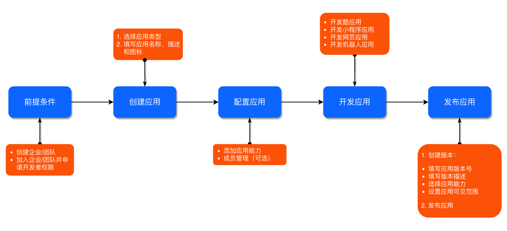

# 应用嵌入钉钉对接流程

## 钉钉应用开发流程

[钉钉应用开发流程](https://open.dingtalk.com/document/orgapp/overview-of-development-process)

### 开发网页应用服务端

[开发网页应用服务端](https://open.dingtalk.com/document/orgapp/develop-webapp-backend)

1. [获取企业内部应用的accessToken  新版SDK](https://open.dingtalk.com/document/orgapp/obtain-the-access_token-of-an-internal-app#)

2. [查询用户详情 旧版SDK](https://open.dingtalk.com/document/orgapp/query-user-details)
